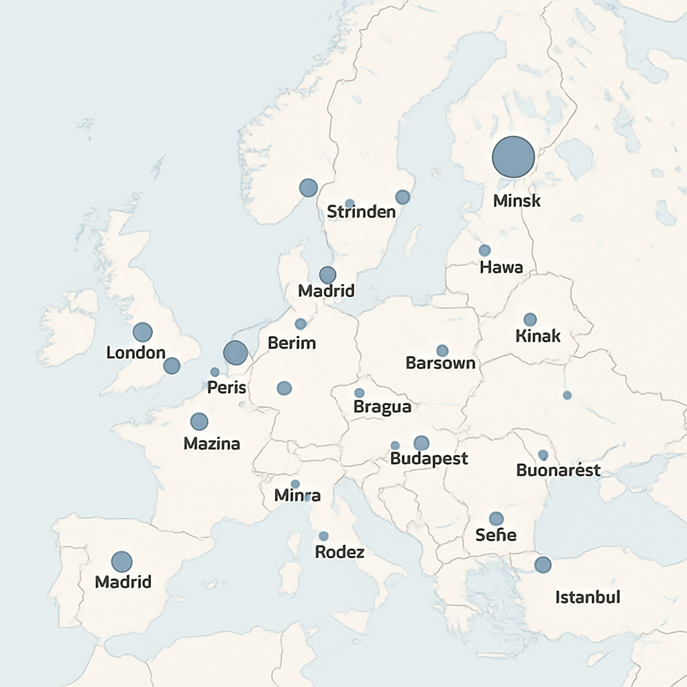

# 35 Largest European Cities by Population



## Overview

This project visualizes the 35 largest European cities by population using an interactive map created with Leaflet. The visualization provides an intuitive way to understand the distribution and relative sizes of major urban centers across Europe.

## Features

- **Interactive Map**: Explore the 35 largest European cities with an interactive Leaflet map
- **Population Visualization**: City markers sized proportionally to population
- **Detailed Information**: Click on any city to view its population and country with flag
- **Responsive Design**: Fully responsive layout that works on desktop and mobile devices
- **Data Transparency**: Complete dataset included and documented

## Live Demo

You can view the live interactive map at: [https://galafis.github.io/R-Markdown-and-Leaflet/](https://galafis.github.io/R-Markdown-and-Leaflet/)

## Project Structure

```
R-Markdown-and-Leaflet/
├── index.html          # Main HTML file with the interactive map
├── data/
│   └── cities.csv      # Dataset containing city information
├── images/
│   └── map_preview.png # Preview image of the map
└── README.md           # This documentation file
```

## Dataset

The dataset (`data/cities.csv`) contains information about the 35 largest European cities, including:

- City name
- Population
- Country
- Geographic coordinates (latitude and longitude)
- URL to the country's flag image

## Implementation Details

The visualization was implemented using:

- **HTML/CSS/JavaScript**: For the web interface and styling
- **Leaflet.js**: For the interactive mapping functionality
- **R (original data processing)**: The data was initially processed using R with the following workflow:
  1. Reading the CSV data
  2. Formatting population numbers with commas for readability
  3. Creating HTML-formatted popup content with city information and flags
  4. Generating circle markers with sizes proportional to population

## How to Use

### Local Development

1. Clone this repository:
   ```
   git clone https://github.com/galafis/R-Markdown-and-Leaflet.git
   ```

2. Navigate to the project directory:
   ```
   cd R-Markdown-and-Leaflet
   ```

3. Open `index.html` in your web browser to view the map locally.

### Adding or Updating Cities

To add or update cities in the dataset:

1. Edit the `data/cities.csv` file
2. Ensure each entry has the required fields (City, Population, Country, Lat, Lng, FlagURL)
3. Reload the page to see your changes

## Technical Approach

The visualization uses a combination of techniques:

1. **Data Loading**: Asynchronously loads the CSV data using JavaScript's Fetch API
2. **Data Parsing**: Custom CSV parser to convert the raw data into a usable format
3. **Map Rendering**: Leaflet.js for rendering the base map and interactive elements
4. **Responsive Design**: CSS media queries to ensure the visualization works on all devices
5. **Visual Encoding**: Circle size is calculated using a square root scale to accurately represent population differences

## Future Enhancements

Potential future improvements include:

- Adding time-series data to show population changes over time
- Implementing clustering for better visualization at different zoom levels
- Adding additional demographic information for each city
- Creating comparison tools to analyze multiple cities simultaneously

## License

This project is licensed under the MIT License - see the LICENSE file for details.

## Author

Created by Gabriel Demetrios Lafis on May 28, 2025.

---

© 2025 Gabriel Demetrios Lafis. All rights reserved.
